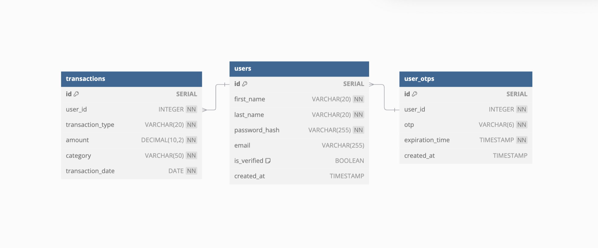

# API Documentation for Transaction Management





## Base URL: https://budgeting-app-backend-bgr1.onrender.com/api
- [budgeting-app-backend Github Repo](https://github.com/AnitaOwen/budgeting-app-backend)
- [budgeting-app-frontend Github Repo](https://github.com/AnitaOwen/budgeting-app-frontend)
- [Deployed Frontend UI](https://clinquant-rolypoly-ea3737.netlify.app)


## Getting Started

To set up and run the **Budgeting App** on your local machine, follow these steps:

### Backend Setup

1. **Clone the Backend Repository**: Fork and clone the backend repository to your local machine.

    ```bash
    git clone https://github.com/AnitaOwen/budgeting-app-backend
    ```

2. **Install Dependencies**: Navigate to the project directory and install the necessary dependencies.

    ```bash
    cd budgeting-app-backend
    npm install
    ```

3. **Seed the Database**: Initialize and seed the database to populate it with initial data.

    ```bash
    npm run db:init
    npm run db:seed
    ```

4. **Run the Backend Server**: Start the backend server to handle API requests.

    ```bash
    npm run dev
    ```
    
## Authentication

Authentication is required for users to access the API endpoints, particularly when interacting with sensitive resources such as transactions. The API uses JSON Web Tokens (JWT) for authentication, which helps verify the identity of the user making requests.

### 1. User Registration (via Frontend UI)
[**Deployed Frontend UI**](https://clinquant-rolypoly-ea3737.netlify.app)

To register a new user, users must go through the frontend user interface (UI) of the deployed Budgeting App. The UI provides an easy-to-use form for user registration, which communicates with the backend to create a new account.

- **Submit the Registration Form**:
Upon submitting the register form, the frontend UI will send a POST request to the backend API with the user details (email, password, etc.).

- **Backend Sends Verification Email**:
After receiving the registration request, the backend will
check if the email is valid and not already in use, then the backend will send an email verification link to the provided email address. The user will need to click the link sent by the backend to receive a token for accessing the database. 

### 2. How To Authenticate An Existing User (via Frontend UI)
[**Deployed Frontend UI**](https://clinquant-rolypoly-ea3737.netlify.app)
- **Login**: Users authenticate by submitting their credentials (email and password) to the login form in the frontend. If the credentials are valid, the backend will generate a unique OTP and send it to user's email address. The user will receive an email containing the 6-digit OTP sent by the backend. After confirming the OTP, the server responds with a JWT token that the user can use for subsequent requests.

- **Using the JWT Token**: Once users obtain their JWT token, they must include it in the Authorization header of subsequent requests to protected endpoints. The format is typically as follows:
`Authorization: Bearer <your_jwt_token_here>`

**Token Expiration**: The JWT token is time-limited, and after it expires, users will need to authenticate again to obtain a new token.

## Endpoints Access
Authorization determines whether the authenticated user has permission to access specific resources or perform certain actions.

``GET /transactions/:id`` (Fetch all transactions for a user)

- Authorization: Requires the user to be authenticated. Only the user whose id matches the user_id field in the transaction can access the transactions.
**Example**: A user with user_id: 2 can only access their own transactions (/transactions/2).

``POST /transactions`` (Add a new transaction)

- Authorization: Requires a valid JWT token. The user can only add a transaction to their own account.

``PUT /transactions/:id`` (Update a transaction)

- Authorization: Requires the user to be the owner of the transaction being updated. The user_id field in the transaction must match the authenticated user's ID. For example, user 2 can only update their own transactions.

``DELETE /transactions/:id`` (Delete a transaction)

- Authorization: The authenticated user can only delete their own transactions. If the user_id of the transaction being deleted does not match the authenticated user’s ID, a 403 Forbidden response is returned.


## Endpoints

### 1. Get All Transactions by User ID
- **Endpoint**: `GET /transactions/:id`
- **Description**: Retrieves a list of all transactions for a user.

#### Example Response Body:
  ```json
{
    "transactions": [
      {
        "id": 1,
        "transaction_date": "2024-12-04",
        "category": "Food",
        "amount": 50.00
      },
      {
        "id": 2,
        "transaction_date": "2024-12-05",
        "category": "Salary",
        "amount": 2000.00
      }
    ]
}
  ```
- `transactions`: An array of transaction objects.
  - Each transaction object contains:
    - `id`: The unique ID of the transaction.
    - `user_id`: References an id from the users table
    - `transaction_date`: The date of the transaction.
    - `category`: The category of the transaction (e.g., "Food", "Salary").
    - `amount`: The amount of the transaction in USD.
    - `transaction_type`: Can be either "income" or "expense"


### 2. Add a new transaction
- **Endpoint**: `POST /transactions`
- **Description**: Add a new transaction to the transactions table for the user. 

#### Example Request Body:
```json
{
  "user_id": 2,
  "transaction_date": "2024-12-04",
  "category": "Food",
  "amount": 20.00,
  "transaction_type": "expense"
}
```

#### Example Response Body:
- **Response Body**: Returns an updated list of all transactions for the user including the new entry.
```json
{
  "transactions": [
    {
      "id": 13,
      "user_id": 2,
      "transaction_type": "expense",
      "transaction_date": "2024-12-04",
      "category": "Food",
      "amount": 20.00
    },
    {
      "id": 4,
      "user_id": 2,
      "transaction_type": "income",
      "transaction_date": "2024-12-05",
      "category": "Salary/Income",
      "amount": 500.00
    }
  ]
}
```
### 3. Update an existing transaction
- **Endpoint**: `PUT /transactions`
- **Description**: Update a transaction in the transaction table by id.

- **Response Body**: An updated list of all transactions for the user including the updated entry.
  ```json
  {
    "transactions": [
      {
        "id": 13,
        "user_id": 2,
        "transaction_type": "expense",
        "transaction_date": "2024-12-04",
        "category": "Food",
        "amount": 20.00
      },
      {
        "id": 4,
        "user_id": 2,
        "transaction_type": "income",
        "transaction_date": "2024-12-05",
        "category": "Salary/Income",
        "amount": 500.00
      },
    ]
  }
  ```

  ### 4. Delete a transaction
- **Endpoint**: `DELETE /transactions/:id`
- **Description**: Delete a transaction in the transaction table by transaction id.

- **Response Body**: Returns the deleted transaction.
  ```json
  {
    "transactions": [
      {
        "id": 13,
        "user_id": 2,
        "transaction_type": "expense",
        "transaction_date": "2024-12-04",
        "category": "Food",
        "amount": 20.00
      }
    ]
  }
  ```
## References & Resources

- **[JWT (JSON Web Token) Documentation](https://jwt.io/introduction/)** - Official JWT documentation for understanding token-based authentication.
- **[Express.js Documentation](https://expressjs.com/)** - Official documentation for the Express.js framework used in the backend.
- **[PostgreSQL Documentation](https://www.postgresql.org/docs/)** - Comprehensive guide to PostgreSQL, the database system used in the project.
- **[Bcrypt.js Documentation](https://www.npmjs.com/package/bcryptjs)** - For hashing passwords securely using bcrypt in Node.js.
- **[CORS Documentation](https://developer.mozilla.org/en-US/docs/Web/HTTP/CORS)** - Learn about Cross-Origin Resource Sharing (CORS) and how it’s handled in Express apps.
- **[GitHub API Documentation](https://docs.github.com/en/rest)** - For understanding GitHub API usage if integrating further functionality.
- **[Node.js Documentation](https://nodejs.org/en/docs/)** - Official Node.js documentation for backend development.


